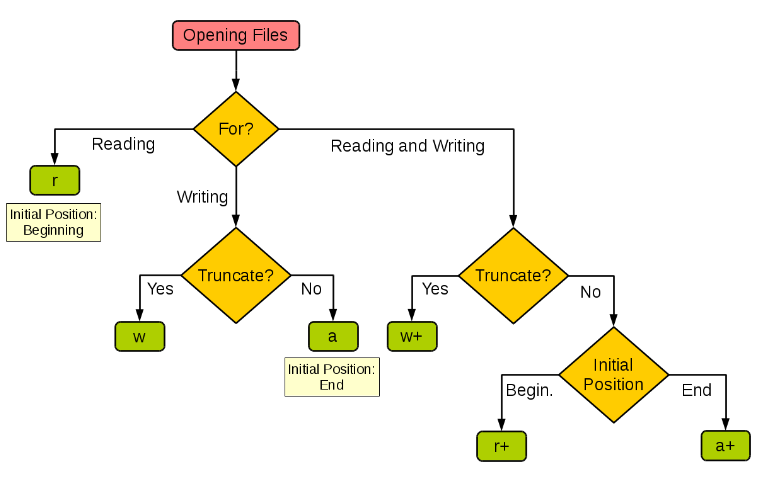

# Days-05

## 文件和异常

python内实现文件的读写可通过open函数来实现，具体如下
```
'r' 读取(默认)
'w' 写入(会先截断之前的内容)
'x' 写入，如果文件已存在会产生异常
'a' 追加，将内容写入到已有文件的末尾
'b' 二进制模式
't' 文本模式(默认)
'+' 更新(既可以读又可以写)
```

具体文件操作模式如下



#### 读写文本文件
```
#正常读写文件
f = open('***.txt', 'r', encoding='uft-8')
print(f.read())
f.close()
```
```
#读写之前加上文件异常处理
try:
    with open('***.txt', 'r', encoding='utf-8') as f:
        print(f.read())
except FileNotFoundError:
    print('无法打开指定的文件!')
except LookupError:
    print('指定了未知的编码!')
except UnicodeDecodeError:
    print('读取文件时解码错误!')
```
```
#通过for-in循环逐行读取
with open('***.txt', mode='r') as f:
    for line in f:
        print(line, end='')
        time.sleep(0.5)
print()
```
```
#读取文件按行读取到列表中
with open('***.txt') as f:
    lines = f.readlines()
print(lines)
```

#### 读写二进制文件
```
try:
    with open('***.jpg', 'rb') as fs1:
        data = fs1.read()
        print(type(data))
    with open('***.jpg', 'wb') as fs2:
        fs2.write(data)
except FileNotFoundError as e:
    print('指定的文件无法打开.')
except IOError as e:
    print('读写文件时出现错误.')
print('程序执行结束.')
```

#### 读写json文件

可以用python中的json模块，将字典或列表以JSON格式保存到文件中
```
try:
    with open('data.json, 'w', encoding='utf-8') as fs:
        json.dump(mydict, fs)
except IOError as e:
    print(e)
print('保存数据完成!')
```
json模块主要有四个比较重要的函数，分别是：

dump - 将Python对象按照JSON格式序列化到文件中

dumps - 将Python对象处理成JSON格式的字符串

load - 将文件中的JSON数据反序列化成对象

loads - 将字符串的内容反序列化成Python对象