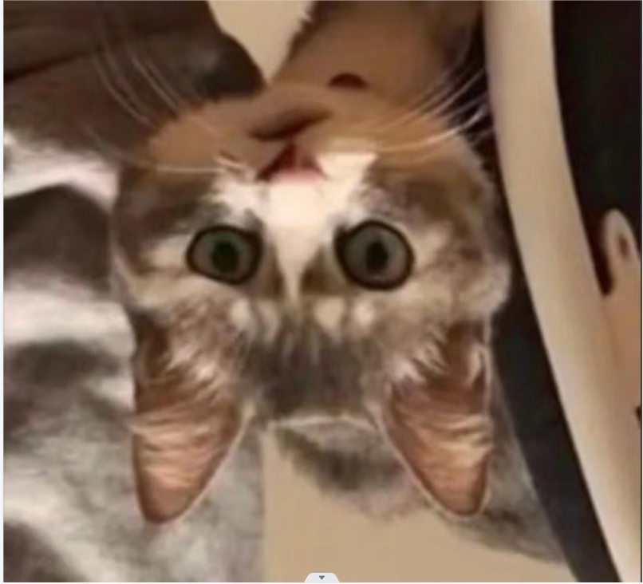
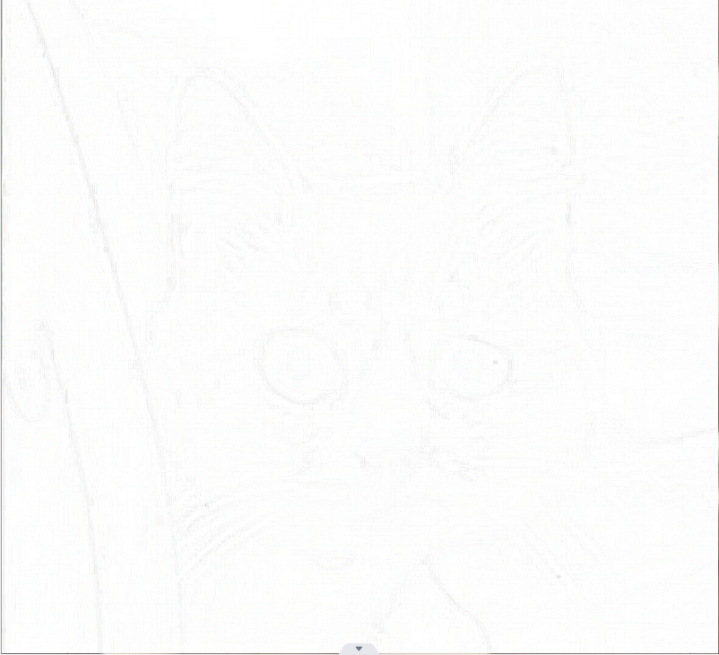

# Days-08

做到这里时，第一步差不多就可以学完了，由于我侧重于学习图像处理，因此这篇篇幅较长~

## 简单处理图像(Pillow类)

#### 读取图像
```
from PIL import Image

image = Image.open('./11.jpg')
image.show()
```
读取效果


#### 裁剪图像
```
from PIL import Image

image = Image.open('./11.jpg')
rect = 30, 30, 300, 360
image.crop(rect).show()
```
读取效果


#### 生成缩略图
```
from PIL import Image

image = Image.open('./11.jpg')
size = 128, 128
image.thumbnail(size)
image.show()
```
读取效果


#### 旋转和翻转
```
from PIL import Image

image = Image.open('./11.jpg')
image.rotate(180).show()
image.transpose(Image.FLIP_LEFT_RIGHT).show()
```
读取效果


#### 滤镜效果
```
from PIL import Image,ImageFilter

image = Image.open('./11.jpg')
image.filter(ImageFilter.CONTOUR).show()
```
读取效果


##### 以上就是简单的图像处理了，后面会涉及比较复杂的图像处理

